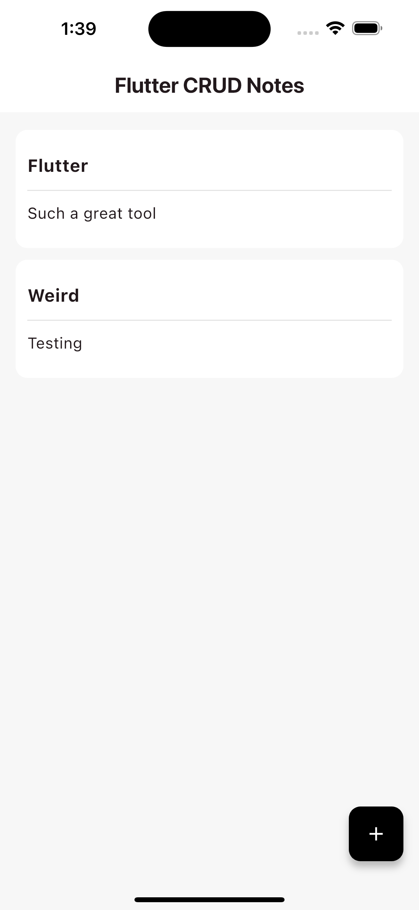
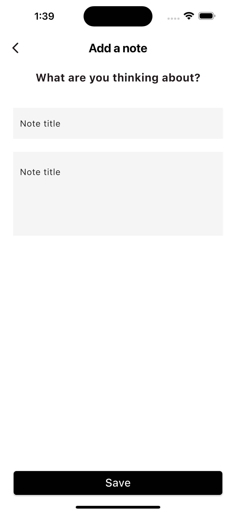

# 🚀 FlutterCRUDNotes

This app is designed for training purposes, focusing on CRUD operations using a local SQFLite database in Flutter.

---

## 📦 Setup

When creating a version of this Flutter project, ensure to use the folder name **`flutter_crud_notes`** to adhere to Dart package naming conventions.

---

## 💻 Technologies

- **Flutter**: The UI toolkit for building natively compiled applications.
- **Dart**: The programming language used for Flutter development.
- **SQFLite**: The local database used for persistent storage.

---

## 📱 Screens

Here are some screenshots of the application:

    
    
   

---

## ✨ Features

- Create, Read, Update, and Delete notes.
- Store notes locally using SQFLite.
- User-friendly interface.

---

## 📄 License

This project is licensed under the MIT License - see the [LICENSE](LICENSE) file for details.

---

Feel free to contribute to the project or report issues on the [GitHub repository](https://github.com/CilanCodes/FlutterCRUDNotes).
